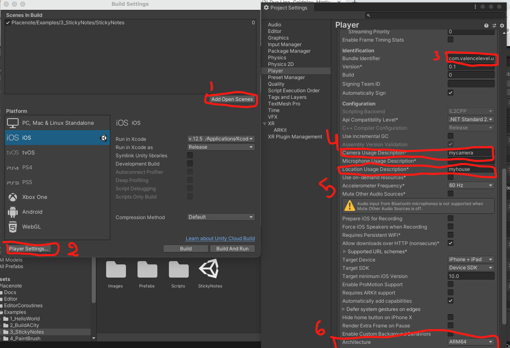
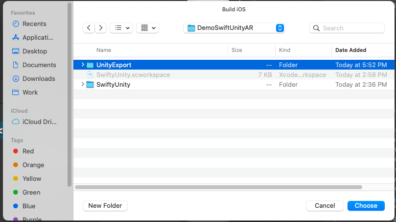
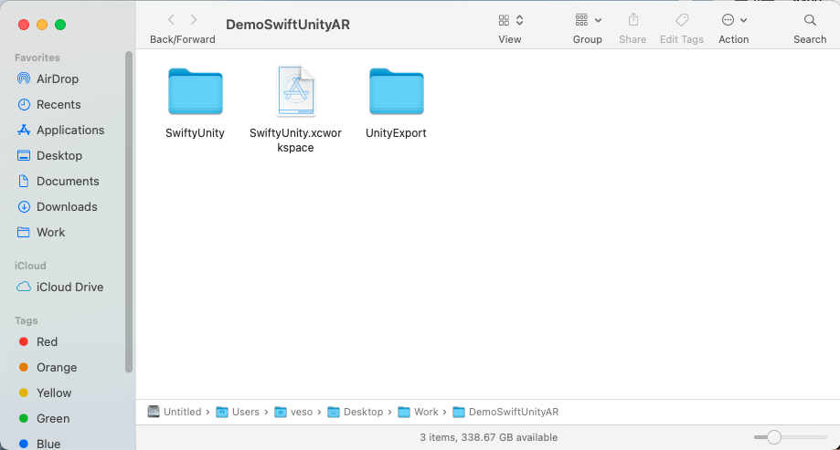

# Launch a Unity Augmented Reality (AR) App from a SwiftUI iOS App.
Just for reference, I am using: 
* Xcode version 12.5
* Unity version: 2019.4.26f1
* Also need Apple developer account (if not enroll [here](https://developer.apple.com/app-store/small-business-program/))
### [Limitations](https://docs.unity3d.com/Manual/UnityasaLibrary.html) of Using Unity as a Library in other applications
* Starting with **Unity 2019.3**, you can use Unity as a Library in other applications by integrating your content and the Unity runtime components in a native platform project. This enables you to embed content that uses 3D or 2D real-time rendering
, like AR
 experiences, interaction with 3D models, 2D mini-games, and so on. The Unity Runtime Library exposes ways to manage loading, activating, and unloading within the native application.
* Only full-screen rendering is supported. It’s not possible to render only on a part of the screen.
* When Unity is in an unloaded state (after calling ``Application.Unload``), it retains some amount of memory (between 80–180Mb) to be able to instantly switch back and run again in the same process. The amount of memory that is not released largely depends on the device’s graphics resolution.
* On iOS, if the Unity runtime quits entirely (after calling ``Application.Quit``), it’s not possible to reload Unity again in the same app session.
* You can’t load more than one instance of the Unity runtime, or integrate more than one Unity runtime.
* You might need to adapt your native and managed plug-ins
 to work properly.

 ## Create Unity AR app in Swift iOS App from **scratch** with Placenote SDK.
 To be able to use Augmented Reality in Unity we have to import 3rd party libary, SDK or plugins in Unity project(ex. Wikitude, Vuforiaand Placenote etc.)
### Create the iOS project
1. First, you need to create an empty iOS project inside a workspace. An easy way to do this is to first create an empty XCode project, and then go to File → Save As Workspace. Let’s name both the project and the workspace SwiftyUnity.

    I will create ``DemoSwiftUnityAR`` folder which will be the main folder to store the project in it.
2. Create Xcode project (To deploy to iOS device you need MacBook).

3. Select App and then Next.
4. Choose options for your new project:

    **Important:**

    Make sure you select Storyboard as the Interface and UIKit App Delegate as the project Life Cycle. Don’t worry, we will convert this to a SwiftUI app later on, these steps are needed just to get the Unity integration working.

    Also, since this will be a SwiftUI project, don’t forget to set the minimum iOS deployment target to 13.0.
5. Choose directory where to create the empty Swift project (in my case I created ``DemoSwiftUnityAR`` in step 1).
6. Now we need to create workspace, in order to do so we go our freshly created Xcode project File → new → workspace...

7. Now in DemoSwiftUnityAR we have to have two items:
    * SwiftyUnity Folder
    * SwiftyUnity.xcworkspace file
### Create the Unity project
Next, you need to create an empty Unity project. It doesn’t matter where it’s located, but it’s best to have it in the same folder where our workspace and the iOS project reside. Let’s call the Unity project UnityGame.

### Import Placenote SDK in Unity
Documentation is pretty well writen, so I will just leave links and we can easy follow it.
1. We need to download Placenote SDK so we can import it in Unity - Register and sign in [here](https://placenote.com/)
2. Follow documentation for Download the Unity SDK with Unity Package file [here](https://docs.placenote.com/unity/unity-getting-started/download-the-unity-sdk)
3. Setting up your Placenote project [here](https://docs.placenote.com/unity/build-the-sample-apps/build-a-unity-scene)
4. After you set up the steps from the documentaton, go to File → Build Settings → Player settings add:
    1. Add the Scene from the example folder which you have already following the documentation, in my case I chose StickyNotes example.
    2. Player Setting
    3. Add Bundle Identifier which I asume you have after you enrolled for apple developer on the link provided in the begging of the documentation.
    4. You need to add description as a string in the Camera Description for security issue, after 13 iOS apple add it.
    5. The same thing for location
    6. Most important not mentioned in the documentation. Change the Architecture **Universal → ARM64**

    7. Now the project is all set up and ready to be build. We are going to File → Build Settings → Build
    8. We are going to Build it in main folder which we are working in ``DemoSwiftUnityAR``.
        * New Folder - name it UnityExport
        * Get in the UnityExport folder and build it there.

This is how our main project needs to look like after we have build iOS Swift app and UnityExport app.

### Connect Unity with iOS
### And now... some code!
