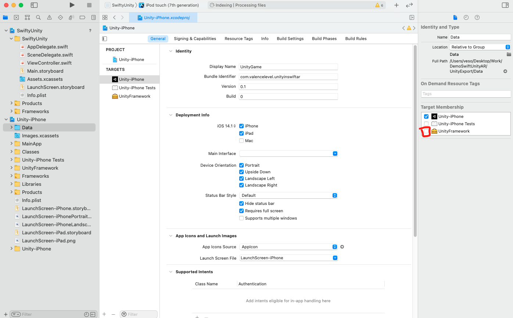

# Launch a Unity Augmented Reality (AR) App from a SwiftUI iOS App.
Just for reference, I am using: 
* Xcode version 12.5
* Unity version: 2019.4.26f1
* Also need Apple developer account (if not enroll [here](https://developer.apple.com/app-store/small-business-program/))
### [Limitations](https://docs.unity3d.com/Manual/UnityasaLibrary.html) of Using Unity as a Library in other applications
* Starting with **Unity 2019.3**, you can use Unity as a Library in other applications by integrating your content and the Unity runtime components in a native platform project. This enables you to embed content that uses 3D or 2D real-time rendering
, like AR
 experiences, interaction with 3D models, 2D mini-games, and so on. The Unity Runtime Library exposes ways to manage loading, activating, and unloading within the native application.
* Only full-screen rendering is supported. It’s not possible to render only on a part of the screen.
* When Unity is in an unloaded state (after calling ``Application.Unload``), it retains some amount of memory (between 80–180Mb) to be able to instantly switch back and run again in the same process. The amount of memory that is not released largely depends on the device’s graphics resolution.
* On iOS, if the Unity runtime quits entirely (after calling ``Application.Quit``), it’s not possible to reload Unity again in the same app session.
* You can’t load more than one instance of the Unity runtime, or integrate more than one Unity runtime.
* You might need to adapt your native and managed plug-ins
 to work properly.

 ## Create Unity AR app in Swift iOS App from **scratch** with Placenote SDK.
 To be able to use Augmented Reality in Unity we have to import 3rd party libary, SDK or plugins in Unity project(ex. Wikitude, Vuforiaand Placenote etc.)
### Create the iOS project
1. First, you need to create an empty iOS project inside a workspace. An easy way to do this is to first create an empty XCode project, and then go to **File → Save As Workspace**. Let’s name both the project and the workspace SwiftyUnity.

    I will create ``DemoSwiftUnityAR`` folder which will be the main folder to store the project in it.
2. Create Xcode project (To deploy to iOS device you need MacBook).

3. Select App and then Next.
4. Choose options for your new project:


    **Important:**

    Make sure you select Storyboard as the Interface and UIKit App Delegate as the project Life Cycle. Don’t worry, we will convert this to a SwiftUI app later on, these steps are needed just to get the Unity integration working.

    Also, since this will be a SwiftUI project, don’t forget to set the minimum iOS deployment target to 13.0.
5. Choose directory where to create the empty Swift project (in my case I created ``DemoSwiftUnityAR`` in step 1).
6. Now we need to create workspace, in order to do so we go our freshly created Xcode project **File → new → workspace...**

7. Now in DemoSwiftUnityAR we have to have two items:
    * SwiftyUnity Folder
    * SwiftyUnity.xcworkspace file
### Create the Unity project
Next, you need to create an empty Unity project. It doesn’t matter where it’s located, but it’s best to have it in the same folder where our workspace and the iOS project reside. Let’s call the Unity project UnityGame.

### Import Placenote SDK in Unity
Documentation is pretty well writen, so I will just leave links and we can easy follow it.
1. We need to download Placenote SDK so we can import it in Unity - Register and sign in [here](https://placenote.com/)
2. Follow documentation for Download the Unity SDK with Unity Package file [here](https://docs.placenote.com/unity/unity-getting-started/download-the-unity-sdk)
3. Setting up your Placenote project [here](https://docs.placenote.com/unity/build-the-sample-apps/build-a-unity-scene)
4. After you set up the steps from the documentaton, go to **File → Build Settings → Player** settings add:
    1. Add the Scene from the example folder which you have already following the documentation, in my case I chose StickyNotes example.
    2. Player Setting
    3. Add Bundle Identifier which I asume you have after you enrolled for apple developer on the link provided in the begging of the documentation.
    4. You need to add description as a string in the Camera Description for security issue, after 13 iOS apple add it.
    5. The same thing for location
    6. Most important not mentioned in the documentation. Change the Architecture **Universal → ARM64**

    7. Now the project is all set up and ready to be build. We are going to **File → Build Settings → Build**
    8. We are going to Build it in main folder which we are working in ``DemoSwiftUnityAR``.
        * New Folder - name it UnityExport
        * Get in the UnityExport folder and build it there.


This is how our main project needs to look like after we have build iOS Swift app and UnityExport app.
* Swifty Unity, the main iOS app.
* UnityExport, created by exporting the Unity game as an iOS project.
* SwiftyUnity.xcworkspace.


    If your folder structure doesn’t look like this, don’t worry. Everything will still work as long as you connect the projects properly, which we will do in the next step

### Connect Unity with iOS
It’s time to connect the exported Unity project with our SwiftUI app. Open the SwiftyUnity.xcworkspace, which currently only contains the SwiftyUnity project.

1. In Finder, locate the main project folder ``DemoSwiftUnityAR`` open **SwiftlyUnity.xcworkspace** and drag in the workspace:
* **SwiftlyUnity.xcodeproj**, from SwiftlyUnity folder.
* **Unity-iPhone.xcodeproj**, from UnityExport folder.

Now both SwiftyUnity.xcodeproj and Unity-iPhone.xcodeproj belong to the same workspace. If your Unity-iPhone.xcodeproj is red after dragging, make sure that you set Location to Relative to Workspace in the right panel of the project.

2. Make sure you have account connected to the Xcode from **Xcode → Preferences → @Account**

3. After you Signin to Xcode, you will have to Sign in the SwiftyUnity proj and Unty-iPhone proj in **Signin & Capabilities** Tab.
    
    * I Created **com.valencelevel.unityinswiftar** on my Apple Developer Account and I use this Bundle Identifier for swiftyUnity and Unity-iPhone projects.
    
4. Next, click on SwiftyUnity project and select the SwiftyUnity target. From the **General** menu, scroll down to the **Frameworks, Libraries and Embedded Content** section. Click on the **+** button to add a new framework.
    * While we are here I will move the iOS version to 13.4 (in my case I have iPhone with lower iOS iPhone XR), !Don't target lower than 13
    
    * Select **UnityFramework.framework** from the list and add it to the project.
    
5. Next, select the **Data** folder in Unity-iPhone project. In the right panel, you will see a Target Membership section. You need to check the box next to UnityFramework.
    
6. Next, open **Info.plist** in SwiftlyUnity project and remove the Application Scene Manifest entry. This will temporarily break the app but we’ll resolve it later in the AppDelegate.
    
### And now... some code!
1. Let’s first add a new SwiftUI View called ContentView.swift, which will be our entry point to SwiftUI. We’ll add a single button that will launch the game. We will leave the button listener empty for now, and return here once we prepare the code that launches the Unity game.
    * Right click on **SwiftyUnity folder → New File → SwiftUI View → Save as: ContentView**
    * Add that code inside the file:
    import SwiftUI
    ```
    struct ContentView: View {
        var body: some View {
            Button(action: {
                        // TODO: Add code for launching Unity here
                    }) {
                        Text("Launch Unity!")
                    }
        }
    }

    struct ContentView_Previews: PreviewProvider {
        static var previews: some View {
            ContentView()
        }
    }
    ```
    * This is how the file need to looks like
    
2. Since we initially created a UIKit Storyboard app (and not a SwiftUI app), we now need to connect our ContentView with the root ViewController that has been generated. So the next step is to update our **ViewController.swift** code:
    ```
    import UIKit
    import SwiftUI

    class ViewController: UIViewController {

        override func viewDidLoad() {
            super.viewDidLoad()
            // Do any additional setup after loading the view.
            let vc = UIHostingController(rootView: ContentView())
                    addChild(vc)
                    vc.view.frame = self.view.frame
                    view.addSubview(vc.view)
                    vc.didMove(toParent: self)
        }

    }
    ```
    * This is how the **ViewController.swift** looks like
    
3. The most important step, of course, is to implement the connection with the app and the game through UnityFramework that we imported earlier. If you want to learn more about the framework, you can visit the official docs [here](https://docs.unity3d.com/Manual/UnityasaLibrary-iOS.html).
4. We will create a helper singleton class called **Unity**, which we can use for all our UnityFramework-related needs.
    * Right click on **SwiftyUnity folder → New File → Swift File → Save as: Unity** (notice that this time we create **Swift File** not **~~SwiftUI View~~**).
    * Create a new class and fill it with the following code:
    ```
    import Foundation
    import UnityFramework

    class Unity: UIResponder, UIApplicationDelegate {

        static let shared = Unity()

        private let dataBundleId: String = "com.unity3d.framework"
        private let frameworkPath: String = "/Frameworks/UnityFramework.framework"

        private var ufw : UnityFramework?
        private var hostMainWindow : UIWindow?

        private var isInitialized: Bool {
            ufw?.appController() != nil
        }

        func show() {
            if isInitialized {
                showWindow()
            } else {
                initWindow()
            }
        }

        func setHostMainWindow(_ hostMainWindow: UIWindow?) {
            self.hostMainWindow = hostMainWindow
        }

        private func initWindow() {
            if isInitialized {
                showWindow()
                return
            }

            guard let ufw = loadUnityFramework() else {
                print("ERROR: Was not able to load Unity")
                return unloadWindow()
            }

            self.ufw = ufw
            ufw.setDataBundleId(dataBundleId)
            ufw.register(self)
            ufw.runEmbedded(
                withArgc: CommandLine.argc,
                argv: CommandLine.unsafeArgv,
                appLaunchOpts: nil
            )
        }

        private func showWindow() {
            if isInitialized {
                ufw?.showUnityWindow()
            }
        }

        private func unloadWindow() {
            if isInitialized {
                ufw?.unloadApplication()
            }
        }

        private func loadUnityFramework() -> UnityFramework? {
            let bundlePath: String = Bundle.main.bundlePath + frameworkPath

            let bundle = Bundle(path: bundlePath)
            if bundle?.isLoaded == false {
                bundle?.load()
            }

            let ufw = bundle?.principalClass?.getInstance()
            if ufw?.appController() == nil {
                let machineHeader = UnsafeMutablePointer<MachHeader>.allocate(capacity: 1)
                machineHeader.pointee = _mh_execute_header

                ufw?.setExecuteHeader(machineHeader)
            }
            return ufw
        }
    }

    extension Unity: UnityFrameworkListener {

        func unityDidUnload(_ notification: Notification!) {
            ufw?.unregisterFrameworkListener(self)
            ufw = nil
            hostMainWindow?.makeKeyAndVisible()
        }
    }
    ```
    * This is how ***Unity.swift*** should looks like:
    
5. Let’s set up AppDelegate so we can run the app. Open **AppDelegate.swift** and remove all scene-related functions. We will also need to pass the main app window reference to Unity here since that’s the window we’ll return to once we unload the Unity game.
    * Code to add to **AppDelegate.swift**
    ```
    import UIKit

    @main
    class AppDelegate: UIResponder, UIApplicationDelegate {

        var window: UIWindow?

        func application(_ application: UIApplication, didFinishLaunchingWithOptions launchOptions: [UIApplication.LaunchOptionsKey: Any]?) -> Bool {

            Unity.shared.setHostMainWindow(window)

            return true
        }
    }
    ```
    * After these modifications, your AppDelegate should look like this:
    
6. Next, we have to launch the game from our **ContentView**.
We simply need to call the ``Unity.shared.show()`` method from our **Unity** class inside the button listener. This is the result:
    
7. We need to plug our iPhone to our macBook and choose it as target on the top.
    
8. We have to change **Enable Bitcode** to **No**:
 * **SwiftyUnity → PROJECT → Build Settings → All → Build Options**
* **Unity-iPhone → PROJECT → Build Settings → All → Build Options**
* I will put one image but you have to do the same for both projects.
    
9. Next we need to add Placenote framework to our Unity-iPhone project.
* Go to **Unity-iPhone → TARGETS → Unity-iPhone → General → Frameworks,Libraries, and Embedded Content** and click on the **+**.
    
* Go to **Add Other → Add files → UnityExport → Frameworks → Placenote → Plugins → iOS → Placenote.framework → Open**
* We have added Placenote.framework to our Unity-iPhone project.
    
10. Next we need to add Placenote framework to our SwiftyUnity project.
 * Now we go to **SwiftyUnity → TARGETS → SwiftyUnity → Build Phases → Embed Frameworks** and click on **+**.
 * We go to **Add Other → UnityExport → Frameworks → Placenote → Plugins → iOS → Placenote.framework → **
 * This is how it should look after is added:
 

 11. After iOS 13 Apple added new privacy policy if you App needs to access camera or microphone etc. For that we will need to add some permission and description to the user.

        1. Go to **SwiftUnity → SwiftyUnity folder → info.plist**
        2. Click on **Information Property List → +**
        3.  New field will show and paste that in the field ``NSCameraUsageDescription``, Now we will have field with Key: **Privacy -Camera Usage Description** and empty Value.
        5.  Add whatever you message you want the user to see in my case "Hello from Valence"
        6. This is how the info.plist should looks like.
        
12. All Done! Hit the Play button on top left to start deploying you app to iOS device.